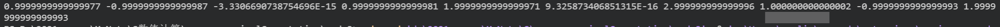

*华东师范大学计算机科学技术系实验报告**

| **实验课程**：  数值计算     | **年级**：  2019        | **实验成绩**：             |
| ---------------------------- | ----------------------- | -------------------------- |
| **实验名称**：  解线性方程组 | **姓名**：  林子炫      |                            |
| **实验编号**：  3            | **学号**：  10195102468 | **实验日期**：  2021-11-17 |
| **指导教师**：  谢堇奎       | **组号**：              | **实验时间**：  9：00AM    |

## 1 实验目的

给出下列几个不同类型的线性方程组，请用适当算法计算其解。

## 2 实验环境

win10 + java

## 3 实验过程与分析

### 3.1 框架搭建

我们需要在图形面板中输入两个向量，分别是ABE和N，A代表积分下限，B代表了积分上限，E代表了`epsilon`，

下面定义了一个插值积分类。

```java
class fun{
    ...
}
```

在下面的框架中，`public class NumericalIntegrating`为主Public类，类中定义了许多Static类型的静态变量，在下面注释中有所解释。类内的函数有：

```java
	public void processInput(String strABEN)
    {
		//处理输入文本框输入的字符串
    }
    /**
     * 更新结果的数值。可以被重写，需要被重写
     */
    public void updateUI(double res)
    {
        //更新JFieldText的数值，来显示输出的结果
    }
    public void updateUI2(double res)
    {
        //重写函数
    }
    public void initUI()
    {
        //初始化UI界面
    }
    public void initMenuBar()
    {     
        //初始化菜单栏
    }
```

所以总体的框架如下：

```java
import java.applet.Applet;
import java.awt.*;
import java.awt.event.ActionEvent;
import java.awt.event.ActionListener;
import javax.swing.*;
import java.awt.Graphics;
public class SolvingLinearEquations{
    
	static String strb;
    static ArrayList<String> strA = new ArrayList<String>();
    static double[][] a;
    static double[] b;
    static public int dim;
    static String test1a = new String(
            "4 2 -3 -1 2 1 0 0 0 0\n8 6 -5 -3 6 5 0 1 0 0\n4 2 -2 -1 3 2 -1 0 3 1\n0 -2 1 5 -1 3 -1 1 9 4\n-4 2 6 -1 6 7 -3 3 2 3\n8 6 -8 5 7 17 2 6 -3 5\n0 2 -1 3 -4 2 5 3 0 1\n16 10 -11 -9 17 34 2 -1 2 2\n4 6 2 -7 13 9 2 0 12 4\n0 0 -1 8 -3 -24 -8 6 3 -1");
    static String test1b = new String("5 12 3 2 3 46 13 38 19 -21");
    static String test2a = new String(
            "4 2 -4 0 2 4 0 0\n2 2 -1 -2 1 3 2 0\n-4 -1 14 1 -8 -3 5 6\n0 -2 1 6 -1 -4 -3 3\n2 1 -8 -1 22 4 -10 -3\n4 3 -3 -4 4 11 1 -4\n0 2 5 -3 -10 1 14 2\n0 0 6 3 -3 -4 2 19");
    static String test2b = new String("0 -6 20 23 9 -22 -15 45");
    static String test3a = new String(
            "4 -1 0 0 0 0 0 0 0 0\n-1 4 -1 0 0 0 0 0 0 0\n0 -1 4 -1 0 0 0 0 0 0\n0 0 -1 4 -1 0 0 0 0 0\n0 0 0 -1 4 -1 0 0 0 0\n0 0 0 0 -1 4 -1 0 0 0\n0 0 0 0 0 -1 4 -1 0 0\n0 0 0 0 0 0 -1 4 -1 0\n0 0 0 0 0 0 0 -1 4 -1\n0 0 0 0 0 0 0 0 -1 4");
    static String test3b = new String("7 5 -13 2 6 -12 14 -4 5 -5");
    static Fun fun = new Fun();
    static String FunType = new String("NULL");
    // 默认的初始模式是空模式
    static String ModeType = new String("NULL");
    //
    static int FunTypeInt = 0;// 1 2 3 4
    // 表示选择的函数 有1，2，3，4四个函数
    static Graphics g;
    // 暂时不会用到画图
    static JFrame frame = new JFrame();
    // 定义了一个Frame
    static String result = new String("");
    /*
     * 下面对JTextField进行static的初始化定义，方便下面直接对其修改
     */
    static JTextField jFieldMode = new JTextField(120);// 模式选择
    static JTextField jFieldResult = new JTextField(120);
    public static void main(String[] args) {
        System.out.println("Test Success!");
        NumericalIntegrating NI = new NumericalIntegrating();

        NI.initMenuBar();// 初始化菜单栏
        NI.initUI();// 初始化UI界面
    }
    /**
     * 处理文本框输入的函数
     * @param ABNE
     */
    public void processInput(String ABNE)
    {
        ...
    }

    public void updateModeStr(int num)// mode表示模式的意思，即插值的类型
    {
        //更新插值模式UI的函数
    }
    public void initUI()
    {
        ...
    }
    public void initMenuBar()
    {   
        ...
    }
}

class Fun {
    public int dimension;
    public double[][] A;
    public double[] B;
    public double[] X;
    public void setData(double b[], double a[][], int dim);
    public String gauss();
    public String calGaussEWPP() ;
    public String Square();
    public String SquareImproved();
    public String zhuigai();    
    
}

```

### 3.2 实现输入输出

`public class SolvingLinearEquations`为主Public类内定义了许多静态变量，strb和ArrayList<String> strA 来存取被读入的数据。

其中，这里实现输入和数据读取的方式是使用ProcessInput函数来实现。

处理输入A前，需要对ArrayList进行清空操作。

```cpp
for (int i = strA.size() - 1; i >= 0; i--)    strA.remove(i);
```

然后调用`ProcessInput`函数。

在`ProcessInput`函数中，对A的输入进行了分割，分割符为空格或者回车，全部分割后再映射到`A[][]`矩阵，对B的分割则按照空格进行分割。

```java
button1.addActionListener(new ActionListener()// 对按钮增加监听
        {
            // 此处需要使用的是匿名类，需要重写actionPerformed函数，否则会出错
            @Override
            public void actionPerformed(ActionEvent e) {
                // 处理输入
                for (int i = strA.size() - 1; i >= 0; i--) {
                    strA.remove(i);
                }
                // 因为是ArrayList，所以每次使用前需要清空
                processInput(jarea.getText(), jFieldX.getText());
                // 将jArea中的字符串处理成字符串数组

                int cnt = 0;
                for (int i = 0; i < dim; i++) {
                    for (int j = 0; j < dim; j++) {
                        a[i][j] = Double.parseDouble(strA.get(cnt++));
                    }
                }

                fun.setData(b, a, dim);

                if (FunTypeInt == 1) {
                    jFieldResult.setText(fun.gauss());
                } else if (FunTypeInt == 2) {
                    jFieldResult.setText(fun.calGaussEWPP());
                } else if (FunTypeInt == 3) {
                    jFieldResult.setText(fun.Square());
                } else if (FunTypeInt == 4) {
                    jFieldResult.setText(fun.SquareImproved());
                } else if (FunTypeInt == 5) {
                    jFieldResult.setText(fun.zhuigai());
                }
            }    
public void processInput(String sa, String sb) {
        String tmpb[] = sb.split(" ");
        b = new double[tmpb.length];
        a = new double[tmpb.length][tmpb.length];
        for (int i = 0; i < tmpb.length; i++) {
            b[i] = Double.parseDouble(tmpb[i]);
        }
        String[] tmpa = sa.split("\n|\\s+");
        for (int i = 0; i < tmpa.length; i++) {
            strA.add(tmpa[i]);
        }
        dim = b.length;
    }
```

### 3.3 更新 U I

对求解模式选定的结果做出更新，在`updateModeStr`中得以实现。

```java
 public void updateModeStr(int num)// mode表示模式的意思，即插值的类型
    {
        if (num == 1) {
            FunType = new String("高斯消元法");
            FunTypeInt = 1;
            jFieldMode.setText(FunType);
        } else if (num == 2) {
            FunType = new String("高斯列主元法");
            FunTypeInt = 2;
            jFieldMode.setText(FunType);
        } else if (num == 3) {
            FunType = new String("平方根法");
            FunTypeInt = 3;
            jFieldMode.setText(FunType);
        } else if (num == 4) {
            FunType = new String("改进的平方根法");
            FunTypeInt = 4;
            jFieldMode.setText(FunType);
        } else if (num == 5) {
            FunType = new String("追赶法");
            FunTypeInt = 5;
            jFieldMode.setText(FunType);
        }
    }
```

### 3.4 初始化 U I

#### 3.4.1 java常用的组件类型

> １、容器组件类
> 所谓容器，就是类似于收纳盒、包、锅碗瓢盆等可以容纳东西的物体。类似地，容器组件就是指可以容纳其他组件的组件，最典型的就是我们经常看到的窗口（窗体）组件。
> **JFrame**是SWING包下的顶级容器组件类。所谓顶级容器，就是说它只能装别的组件，而不能被其他组件所包含。JFrame的作用就是实现一个基本的窗口以及其开关。调整大小等作用。
> **JPanel**是SWING包下的一个容器组件，我们称之为“面板”，可以加在窗体上以实现我们想要的各种布局。
> 2、元素组件类
> 元素组件就是想按钮、标签、复选框等的一类实现某种具体功能的组件。我们经常使用的有以下几种：
> **JLabel** 标签元素组件类 显示文字或者图片
> **JTextField** 文本输入框元素组件类 接收输入信息，将输入信息显示出来
> **JPasswordField** 密码输入框元素组件类 接收输入信息，将输入的信息以某个符号代替显 示
> **JCheckBox** 复选框(多选框)元素组件类 首先又一个选择框，在选择框后还能显示文字或 者图片信息
> **JButton** 按钮元素组件类 显示文字或图片，提供一个点击效果

#### 3.4.1 布局设置

首先对frame的size进行了设置，然后对frame的布局设置成自定义布局，方便下面进行排布。

```java
    frame.setSize(800,600);//设置容器尺寸
    frame.setLayout(new BorderLayout());	
```

然后设置了Jpanel放置在Jframe上，

```java
JPanel p = new JPanel();
p.setLayout(null);
p.setOpaque(false);
```

随后定义了5个label来显示指示信息，并将其add到panel上。

这里需要注意的是，我们对每一个label对定义了bounds，即它的长宽和位于panel的x和y的位置。即**void** java.awt.Component.setBounds(**int** x, **int** y, **int** width, **int** height)

```java
/**
         * 这里是对labels的设置
         */
        JLabel label = new JLabel("输入需要求解方程组的A：");
        label.setBounds(20, 50, 200, 20);
        label.setForeground(Color.BLUE);
        p.add(label);

        JLabel label1 = new JLabel("当前选择的方程组解法：");
        label1.setBounds(20, 20, 200, 20);
        label1.setForeground(Color.BLUE);
        p.add(label1);

        JLabel label6 = new JLabel("请输入需要求解的方程组的B：");
        label6.setBounds(20, 310, 200, 20);
        label6.setForeground(Color.BLUE);
        p.add(label6);

        JLabel label7 = new JLabel("结果向量：");
        label7.setBounds(400, 400, 200, 20);
        label7.setForeground(Color.BLUE);
        p.add(label7);
        jFieldResult.setText("当前结果：未显示");
        jFieldResult.setEditable(false);
        jFieldResult.setBounds(400, 450, 300, 30);
        jFieldMode.setForeground(Color.RED);
        p.add(jFieldResult);

        jFieldMode.setText("当前求解方法：未选择");
        jFieldMode.setEditable(false);
        jFieldMode.setBounds(250, 20, 200, 30);
        jFieldMode.setForeground(Color.RED);
        p.add(jFieldMode);
```

随后添加开始计算按钮。

```java
        JButton button1 = new JButton("开始计算");//
        button1.setBounds(250, 350, 200, 40);// 设置按钮在容器中的位置
        p.add(button1);
```

并对按钮添加点击事件，可以看到实际上这个接口里仅仅有一个方法——“actionPerformed”这个方法就是可以实现动作监听的方法。我们在应用中可以继承这个接口，重写方法并且定义一个“ActionEvent”类型的对象作为参数传到方法里面，然后用“ e.getActionCommand();”这个方法获取组件上的字符串，以进行相应的操作。

```java
button1.addActionListener(new ActionListener()// 对按钮增加监听
        {
            // 此处需要使用的是匿名类，需要重写actionPerformed函数，否则会出错
            @Override
            public void actionPerformed(ActionEvent e) {
                // 处理输入
                for (int i = strA.size() - 1; i >= 0; i--) {
                    strA.remove(i);
                }
                // 因为是ArrayList，所以每次使用前需要清空
                processInput(jarea.getText(), jFieldX.getText());
                // 将jArea中的字符串处理成字符串数组

                int cnt = 0;
                for (int i = 0; i < dim; i++) {
                    for (int j = 0; j < dim; j++) {
                        a[i][j] = Double.parseDouble(strA.get(cnt++));
                    }
                }

                fun.setData(b, a, dim);

                if (FunTypeInt == 1) {
                    jFieldResult.setText(fun.gauss());
                } else if (FunTypeInt == 2) {
                    jFieldResult.setText(fun.calGaussEWPP());
                } else if (FunTypeInt == 3) {
                    jFieldResult.setText(fun.Square());
                } else if (FunTypeInt == 4) {
                    jFieldResult.setText(fun.SquareImproved());
                } else if (FunTypeInt == 5) {
                    jFieldResult.setText(fun.zhuigai());
                }
            }
        });
```

下面函数结尾的必要设置

```java
 		/**
         * 这里是函数结尾的必要设置
         */

        frame.getContentPane().add(p2);
        frame.getContentPane().add(p);
        
        frame.setDefaultCloseOperation(JFrame.EXIT_ON_CLOSE);//界面结束后关闭程序
        frame.setLocationRelativeTo(null);//在屏幕上居中显示框架
        frame.setVisible(true);//界面可视化，需要放在最后面，对所有的组件进行渲染。 
```

`initUI`代码如下：

```java
       public void initUI() {

        /**
         * 这里是对frame的设置
         */
        frame.setSize(800, 600);// 设置容器尺寸
        frame.setLayout(new BorderLayout());
        /**
         * 中间容器
         */
        JPanel p2 = new JPanel() {

            public void paint(Graphics g) {
                super.paint(g);
                g.drawLine(350, 100, 500, 400);
            }
        };
        JPanel p = new JPanel();
        p.setLayout(null);
        p.setOpaque(false);


        /**
         * 这里是对labels的设置
         */
        JLabel label = new JLabel("输入需要求解方程组的A：");
        label.setBounds(20, 50, 200, 20);
        label.setForeground(Color.BLUE);
        p.add(label);

        JLabel label1 = new JLabel("当前选择的方程组解法：");
        label1.setBounds(20, 20, 200, 20);
        label1.setForeground(Color.BLUE);
        p.add(label1);

        JLabel label6 = new JLabel("请输入需要求解的方程组的B：");
        label6.setBounds(20, 310, 200, 20);
        label6.setForeground(Color.BLUE);
        p.add(label6);

        JLabel label7 = new JLabel("结果向量：");
        label7.setBounds(400, 400, 200, 20);
        label7.setForeground(Color.BLUE);
        p.add(label7);
        jFieldResult.setText("当前结果：未显示");
        jFieldResult.setEditable(false);
        jFieldResult.setBounds(400, 450, 300, 30);
        jFieldMode.setForeground(Color.RED);
        p.add(jFieldResult);

        jFieldMode.setText("当前求解方法：未选择");
        jFieldMode.setEditable(false);
        jFieldMode.setBounds(250, 20, 200, 30);
        jFieldMode.setForeground(Color.RED);
        p.add(jFieldMode);

        final JTextArea jarea = new JTextArea("请输入方程组的A", 200, 200);
        jarea.setBounds(20, 90, 200, 200);
        p.add(jarea);

        final JTextField jFieldX = new JTextField(80);
        jFieldX.setBounds(20, 350, 200, 30);
        p.add(jFieldX);

        /**
         * 这里是对Buttons的设置
         */
        JButton button1 = new JButton("开始计算");//
        button1.setBounds(400, 350, 300, 40);// 设置按钮在容器中的位置
        p.add(button1);

        button1.addActionListener(new ActionListener()// 对按钮增加监听
        {
            // 此处需要使用的是匿名类，需要重写actionPerformed函数，否则会出错
            @Override
            public void actionPerformed(ActionEvent e) {
                // 处理输入
                for (int i = strA.size() - 1; i >= 0; i--) {
                    strA.remove(i);
                }
                // 因为是ArrayList，所以每次使用前需要清空
                processInput(jarea.getText(), jFieldX.getText());
                // 将jArea中的字符串处理成字符串数组

                int cnt = 0;
                for (int i = 0; i < dim; i++) {
                    for (int j = 0; j < dim; j++) {
                        a[i][j] = Double.parseDouble(strA.get(cnt++));
                    }
                }

                fun.setData(b, a, dim);

                if (FunTypeInt == 1) {
                    jFieldResult.setText(fun.gauss());
                } else if (FunTypeInt == 2) {
                    jFieldResult.setText(fun.calGaussEWPP());
                } else if (FunTypeInt == 3) {
                    jFieldResult.setText(fun.Square());
                } else if (FunTypeInt == 4) {
                    jFieldResult.setText(fun.SquareImproved());
                } else if (FunTypeInt == 5) {
                    jFieldResult.setText(fun.zhuigai());
                }
            }
        });

        JButton button2 = new JButton("测试样例1---线性方程组");//
        button2.setBounds(20, 400, 200, 40);// 设置按钮在容器中的位置
        p.add(button2);
        button2.addActionListener(new ActionListener() {

            @Override
            public void actionPerformed(ActionEvent e) {
                // TODO Auto-generated method stub
                jarea.setText(test1a);
                jFieldX.setText(test1b);
            }
        });

        JButton button3 = new JButton("测试样例2---对称正定线性方程组");
        button3.setBounds(20, 440, 200, 40);
        p.add(button3);
        button3.addActionListener(new ActionListener() {

            @Override
            public void actionPerformed(ActionEvent e) {
                // TODO Auto-generated method stub
                jarea.setText(test2a);
                jFieldX.setText(test2b);

            }
        });

        JButton button4 = new JButton("测试样例3---三对角型线性方程组");
        button4.setBounds(20, 480, 200, 40);
        p.add(button4);
        button4.addActionListener(new ActionListener() {

            @Override
            public void actionPerformed(ActionEvent e) {
                // TODO Auto-generated method stub
                jarea.setText(test3a);
                jFieldX.setText(test3b);
            }
        });

        /**
         * 这里是函数结尾的必要设置
         */

        frame.getContentPane().add(p2);
        frame.getContentPane().add(p);

        frame.setDefaultCloseOperation(JFrame.EXIT_ON_CLOSE);// 界面结束后关闭程序
        frame.setLocationRelativeTo(null);// 在屏幕上居中显示框架
        frame.setVisible(true);// 界面可视化，需要放在最后面，对所有的组件进行渲染。
    }
```

显示效果如下：


### 3.5 初始化菜单栏

> 一、菜单条（JMenuBar） 
> 　　JMenuBar 的构造方法是 JMenuBar()，相当简单。在构造之后，还要将它设置成窗口的菜单条，这里要用 setJMenuBar 方法: 
> 　　JMenuBar TestJMenuBar=new JMenuBar(); 
> 　　TestFrame.setJMenuBar(TestJMenuBar); 
> 　　需要说明的是，JMenuBar 类根据 JMenu 添加的顺序从左到右显示，并建立整数索引。 
> 二、菜单（JMenu） 
> 　　在添加完菜单条后，并不会显示任何菜单，所以还需要在菜单条中添加菜单。菜单 JMenu 类的构造方法有4种: 
> JMenu() 构造一个空菜单。 JMenu(Action a) 构造一个菜单，菜单属性由相应的动作来提供。 JMenu(String s) 用给定的标志构造一个菜单。 JMenu(String s,Boolean b) 用给定的标志构造一个菜单。如果布尔值为false，那么当释放鼠标按钮后，菜单项会消失；如果布尔值为true，那么当释放鼠标按钮后，菜单项仍将显示。这时的菜单称为 tearOff 菜单。 
> 　　在构造完后，使用 JMenuBar 类的 add 方法添加到菜单条中。 
> 三、菜单项（JmenuItem） 
> 　　接下来的工作是往菜单中添加内容。 在菜单中可以添加不同的内容，可以是菜单项（JMenuItem），可以是一个子菜单，也可以是分隔符。 
> 在构造完后，使用 JMenu 类的 add 方法添加到菜单中。 
> 　 子菜单的添加是直接将一个子菜单添加到母菜单中，而分隔符的添加只需要将分隔符作为菜单项添加到菜单中。 
>
> JMenuBar要set,JMenu要add ，JMenu在new的时候直接指定名字。

这里初始化了JMenu，JMenuItem，JMenuBar。

实例化了JMenuItem如下：

```java
        JMenu Menu1;
        JMenuItem funItem1, funItem2, funItem3, funItem4, funItem5;
        JMenuBar menuBar = new JMenuBar();

        funItem1 = new JMenuItem("高斯消元法");
        funItem2 = new JMenuItem("高斯列主元法");
        funItem3 = new JMenuItem("平方根法");
        funItem4 = new JMenuItem("平方根法改进版");
        funItem5 = new JMenuItem("追赶法");

        Menu1 = new JMenu("求解方法选择");
```

最后需要对每一个JMenuItem增加一个监听，实现选中后内部的逻辑变化。

以下为initMenuBar()函数源码：

```java
     public void initMenuBar() {
        JMenu Menu1;
        JMenuItem funItem1, funItem2, funItem3, funItem4, funItem5;
        JMenuBar menuBar = new JMenuBar();

        funItem1 = new JMenuItem("高斯消元法");
        funItem2 = new JMenuItem("高斯列主元法");
        funItem3 = new JMenuItem("平方根法");
        funItem4 = new JMenuItem("平方根法改进版");
        funItem5 = new JMenuItem("追赶法");

        Menu1 = new JMenu("求解方法选择");

        Menu1.add(funItem1);
        Menu1.add(funItem2);
        Menu1.add(funItem3);
        Menu1.add(funItem4);
        Menu1.add(funItem5);
        Menu1.setSelected(true);
        menuBar.add(Menu1);
        frame.setJMenuBar(menuBar);
        funItem1.addActionListener(new ActionListener() {
            @Override
            public void actionPerformed(ActionEvent e) {
                // updateModeStr("lag");
                updateModeStr(1);
                System.out.println("高斯消元法");

            }
        });
        funItem2.addActionListener(new ActionListener() {

            @Override
            public void actionPerformed(ActionEvent e) {
                // updateModeStr("newton");
                updateModeStr(2);
                System.out.println("高斯列主元法");
            }
        });
        funItem3.addActionListener(new ActionListener() {

            @Override
            public void actionPerformed(ActionEvent e) {
                // updateModeStr("seg");
                updateModeStr(3);
                System.out.println("平方根法");
            }

        });
        funItem4.addActionListener(new ActionListener() {
            @Override
            public void actionPerformed(ActionEvent e) {
                // updateModeStr("seg");
                updateModeStr(4);
                System.out.println("平方根法改进版");
            }
        });
        funItem5.addActionListener(new ActionListener() {
            @Override
            public void actionPerformed(ActionEvent e) {
                // updateModeStr("seg");
                updateModeStr(5);
                System.out.println("追赶法");
            }
        });
    } 
```

### 3.6 插值积分类的实现

类内函数主要有：

* `public void setData(double aa, double bb, int nn, int f) `
* `public String calGaussEWPP()`
* `  public String Square()`
* ` public String SquareImproved()`
* `public String zhuigai()`
* ` public String gauss()`

```java

class Fun {
    public int dimension;
    public double[][] A;
    public double[] B;
    public double[] X;
    public void setData(double b[], double a[][], int dim) {
        dimension = dim;
        // System.out.println(dimension);
        // System.out.println(123213123);
        A = new double[dimension + 2][dimension + 2];
        B = new double[dimension + 2];
        X = new double[dimension + 2];
        for (int i = 1; i <= dimension; i++) {
            B[i] = b[i - 1];
        }
        for (int i = 1; i <= dimension; i++) {
            for (int j = 1; j <= dimension; j++) {
                A[i][j] = a[i - 1][j - 1];
            }
        }
    }
    /**
     * 高斯列主元消元法
     * 
     * @return
     */
    public String calGaussEWPP() {
        int k;
        double t;
        for (int i = 1; i <= dimension; i++) {
            k = i;
            for (int j = i + 1; j <= dimension; j++) {
                if (Math.abs(A[k][i]) < Math.abs(A[j][i])) {
                    k = j;
                }
            }
            for (int j = i; j <= dimension; j++) {
                t = A[i][j];
                A[i][j] = A[k][j];
                A[k][j] = t;
            }
            t = B[i];
            B[i] = B[k];
            B[k] = t;
            for (int j = i + 1; j <= dimension; j++) {
                A[j][i] = A[j][i] / A[i][i];
                for (k = i + 1; k <= dimension; k++) {
                    A[j][k] = A[j][k] - A[j][i] * A[i][k];
                }
                B[j] = B[j] - A[j][i] * B[i];
            }
        }
        for (int i = dimension; i >= 1; i--) {
            for (int j = i + 1; j <= dimension; j++) {
                B[i] = B[i] - A[i][j] * B[j];
            }
            B[i] = B[i] / A[i][i];
        }
        String res = new String("");
        for (int i = 1; i <= dimension; i++) {
            res += String.valueOf(Math.round(B[i]) + " ");
        }
        return res;
    }

    public String Square() {
        double tmp[][] = new double[dimension + 2][dimension + 2];
        for (int i = 1; i <= dimension; i++) {
            for (int j = 1; j <= dimension; j++) {
                tmp[i - 1][j - 1] = A[i][j];
            }
        }
        for (int i = 0; i < dimension; i++) {
            for (int j = 0; j < dimension; j++) {
                A[i][j] = tmp[i][j];
            }
        }
        for (int i = 1; i <= dimension; i++) {
            B[i - 1] = B[i];
        }

        int n = dimension;
        double l[][] = new double[dimension + 2][dimension + 2];
        double g[] = new double[dimension + 2];
        double y[] = new double[dimension + 2];
        double sum;
        for (int i = 0; i < n; i++) { // 分解: A = LDL^T
            sum = 0;
            for (int j = 0; j <= i - 1; j++) {
                for (int k = 0; k <= j - 1; k++)
                    sum += (g[k] * l[i][k] * l[j][k]);
                l[i][j] = (A[i][j] - sum) / g[j];
            }

            sum = 0;
            for (int k = 0; k <= i - 1; k++)
                sum += (g[k] * l[i][k] * l[i][k]);
            g[i] = A[i][i] - sum;
        }

        for (int i = 0; i < n; i++) { // 求y: L(DL^Tx) = b即Ly = b
            sum = 0;
            for (int k = 0; k <= i - 1; k++)
                sum += (l[i][k] * y[k]);
            y[i] = B[i] - sum;
        }

        for (int i = n - 1; i >= 0; i--) { // 求x: L^Tx = D^-1b
            sum = 0;
            for (int k = i + 1; k < n; k++)
                sum += (l[k][i] * X[k]);
            X[i] = y[i] / g[i] - sum;
        }

        String res = new String("");
        for (int i = 0; i < dimension; i++) {
            res += String.valueOf(Math.round(X[i]) + " ");
        }

        return res;
    }

    public String SquareImproved() {
        double tmp[][] = new double[dimension + 2][dimension + 2];
        for (int i = 1; i <= dimension; i++) {
            for (int j = 1; j <= dimension; j++) {
                tmp[i - 1][j - 1] = A[i][j];
            }
        }
        for (int i = 0; i < dimension; i++) {
            for (int j = 0; j < dimension; j++) {
                A[i][j] = tmp[i][j];
            }
        }
        for (int i = 1; i <= dimension; i++) {
            B[i - 1] = B[i];
        }
        for (int i = 0; i < dimension; i++) {
            A[i][dimension] = B[i];
        }
        int n = dimension;
        int i, r, k;
        for (r = 0; r <= n - 1; r++) {
            for (i = r; i <= n; i++)
                for (k = 0; k <= r - 1; k++)
                    A[r][i] -= A[r][k] * A[k][i];
            for (i = r + 1; i <= n - 1; i++) {
                A[i][r] = A[r][i] / A[r][r];
            }
        }
        for (i = n - 1; i >= 0; i--) {
            for (r = n - 1; r >= i + 1; r--)

                A[i][n] -= A[i][r] * X[r];
            X[i] = A[i][n] / A[i][i];
        }
        String res = new String("");
        for (i = 0; i < dimension; i++) {
            res += String.valueOf(Math.round(X[i]) + " ");
        }
        return res;
    }

    public String gauss() {
        int i, j, k;
        double tmp;
        // Guass消元
        int n = dimension;
        for (k = 0; k < (n - 1); k++) {
            for (i = (k + 1); i < n; i++) {
                if (Math.abs(A[k][k]) < 1e-6) {
                    continue;
                }
                tmp = A[i][k] / A[k][k];
                for (j = (k + 1); j < (n); j++) {
                    A[i][j] -= tmp * A[k][j];
                }
                B[i] -= tmp * B[k];
                A[i][k] = 0;
            }
        }
        X[n - 1] = B[n - 1] / A[n - 1][n - 1];
        for (i = (n - 2); i >= 0; i--) {

            X[i] = B[i];
            for (j = (i + 1); j < n; j++) {
                X[i] -= A[i][j] * X[j];
            }
            X[i] /= A[i][i];
        }
        String res = new String("");
        for (i = 0; i < dimension; i++) {
            res += String.valueOf(Math.round(X[i]) + " ");
        }
        return res;
    }
    public String zhuigai()
    {
        int i,j;
        double p;
        double tmp[][] = new double[dimension + 2][dimension + 2];
        for (i = 1; i <= dimension; i++) {
            for (j = 1; j <= dimension; j++) {
                tmp[i - 1][j - 1] = A[i][j];
            }
        }
        for (i = 0; i < dimension; i++) {
            for (j = 0; j < dimension; j++) {
                A[i][j] = tmp[i][j];
            }
        }
        for (i = 1; i <= dimension; i++) {
            B[i - 1] = B[i];
        }
        for (i = 0; i < dimension; i++) {
            A[i][dimension] = B[i];
        }
        int n = dimension;
        for(i=1;i<=n-1;i++)
        {
            p=A[i][i-1]/A[i-1][i-1];
            A[i][i-1]=0;
            A[i][i]-=p*A[i-1][i];
            A[i][n]-=p*A[i-1][n];
    
        }
        X[n-1]=A[n-1][n]/A[n-1][n-1];
        for(j=n-2;j>=0;j--)
        {
            X[j]=(A[j][n]-X[j+1]*A[j][j+1])/A[j][j];
        }
        String res = new String("");
        for (i = 0; i < dimension; i++) {
            res += String.valueOf(Math.round(X[i]) + " ");
        }
        return res;
    }
}
```


## 4 实验结果总结


因为计算出来的答案精度太高，所以需要四舍五入取整。



取整使用`Math.round(double i)`函数。

同时发现案例2的答案是错误的。

正确答案应该为：


## 5 附录

源码

```java
import java.applet.Applet;
import java.awt.*;
import java.awt.event.ActionEvent;
import java.awt.event.ActionListener;
import java.util.ArrayList;
import java.util.Iterator;
import java.util.List;

import javax.swing.*;

import java.awt.Graphics;

public class SolvingLinearEquations {

    static String strb;
    static ArrayList<String> strA = new ArrayList<String>();
    static double[][] a;
    static double[] b;
    static public int dim;
    static String test1a = new String(
            "4 2 -3 -1 2 1 0 0 0 0\n8 6 -5 -3 6 5 0 1 0 0\n4 2 -2 -1 3 2 -1 0 3 1\n0 -2 1 5 -1 3 -1 1 9 4\n-4 2 6 -1 6 7 -3 3 2 3\n8 6 -8 5 7 17 2 6 -3 5\n0 2 -1 3 -4 2 5 3 0 1\n16 10 -11 -9 17 34 2 -1 2 2\n4 6 2 -7 13 9 2 0 12 4\n0 0 -1 8 -3 -24 -8 6 3 -1");
    static String test1b = new String("5 12 3 2 3 46 13 38 19 -21");
    static String test2a = new String(
            "4 2 -4 0 2 4 0 0\n2 2 -1 -2 1 3 2 0\n-4 -1 14 1 -8 -3 5 6\n0 -2 1 6 -1 -4 -3 3\n2 1 -8 -1 22 4 -10 -3\n4 3 -3 -4 4 11 1 -4\n0 2 5 -3 -10 1 14 2\n0 0 6 3 -3 -4 2 19");
    static String test2b = new String("0 -6 20 23 9 -22 -15 45");
    static String test3a = new String(
            "4 -1 0 0 0 0 0 0 0 0\n-1 4 -1 0 0 0 0 0 0 0\n0 -1 4 -1 0 0 0 0 0 0\n0 0 -1 4 -1 0 0 0 0 0\n0 0 0 -1 4 -1 0 0 0 0\n0 0 0 0 -1 4 -1 0 0 0\n0 0 0 0 0 -1 4 -1 0 0\n0 0 0 0 0 0 -1 4 -1 0\n0 0 0 0 0 0 0 -1 4 -1\n0 0 0 0 0 0 0 0 -1 4");
    static String test3b = new String("7 5 -13 2 6 -12 14 -4 5 -5");
    static Fun fun = new Fun();
    static String FunType = new String("NULL");
    // 默认的初始模式是空模式
    static String ModeType = new String("NULL");
    //
    static int FunTypeInt = 0;// 1 2 3 4
    // 表示选择的函数 有1，2，3，4四个函数
    static Graphics g;
    // 暂时不会用到画图
    static JFrame frame = new JFrame();
    // 定义了一个Frame
    static String result = new String("");
    /*
     * 下面对JTextField进行static的初始化定义，方便下面直接对其修改
     */
    static JTextField jFieldMode = new JTextField(120);// 模式选择
    static JTextField jFieldResult = new JTextField(120);

    public static void main(String[] args) {
        System.out.println("Test Success!");
        SolvingLinearEquations NI = new SolvingLinearEquations();

        NI.initMenuBar();// 初始化菜单栏
        NI.initUI();// 初始化UI界面
    }
    public void processInput(String sa, String sb) {
        String tmpb[] = sb.split(" ");
        b = new double[tmpb.length];
        a = new double[tmpb.length][tmpb.length];
        for (int i = 0; i < tmpb.length; i++) {
            b[i] = Double.parseDouble(tmpb[i]);
        }
        String[] tmpa = sa.split("\n|\\s+");
        for (int i = 0; i < tmpa.length; i++) {
            strA.add(tmpa[i]);
        }
        dim = b.length;
    }
    public void initUI() {

        /**
         * 这里是对frame的设置
         */
        frame.setSize(800, 600);// 设置容器尺寸
        frame.setLayout(new BorderLayout());
        /**
         * 中间容器
         */
        JPanel p2 = new JPanel() {

            public void paint(Graphics g) {
                super.paint(g);
                g.drawLine(350, 100, 500, 400);
            }
        };
        JPanel p = new JPanel();
        p.setLayout(null);
        p.setOpaque(false);


        /**
         * 这里是对labels的设置
         */
        JLabel label = new JLabel("输入需要求解方程组的A：");
        label.setBounds(20, 50, 200, 20);
        label.setForeground(Color.BLUE);
        p.add(label);

        JLabel label1 = new JLabel("当前选择的方程组解法：");
        label1.setBounds(20, 20, 200, 20);
        label1.setForeground(Color.BLUE);
        p.add(label1);

        JLabel label6 = new JLabel("请输入需要求解的方程组的B：");
        label6.setBounds(20, 310, 200, 20);
        label6.setForeground(Color.BLUE);
        p.add(label6);

        JLabel label7 = new JLabel("结果向量：");
        label7.setBounds(400, 400, 200, 20);
        label7.setForeground(Color.BLUE);
        p.add(label7);
        jFieldResult.setText("当前结果：未显示");
        jFieldResult.setEditable(false);
        jFieldResult.setBounds(400, 450, 300, 30);
        jFieldMode.setForeground(Color.RED);
        p.add(jFieldResult);

        jFieldMode.setText("当前求解方法：未选择");
        jFieldMode.setEditable(false);
        jFieldMode.setBounds(250, 20, 200, 30);
        jFieldMode.setForeground(Color.RED);
        p.add(jFieldMode);

        final JTextArea jarea = new JTextArea("请输入方程组的A", 200, 200);
        jarea.setBounds(20, 90, 200, 200);
        p.add(jarea);

        final JTextField jFieldX = new JTextField(80);
        jFieldX.setBounds(20, 350, 200, 30);
        p.add(jFieldX);

        /**
         * 这里是对Buttons的设置
         */
        JButton button1 = new JButton("开始计算");//
        button1.setBounds(400, 350, 300, 40);// 设置按钮在容器中的位置
        p.add(button1);

        button1.addActionListener(new ActionListener()// 对按钮增加监听
        {
            // 此处需要使用的是匿名类，需要重写actionPerformed函数，否则会出错
            @Override
            public void actionPerformed(ActionEvent e) {
                // 处理输入
                for (int i = strA.size() - 1; i >= 0; i--) {
                    strA.remove(i);
                }
                // 因为是ArrayList，所以每次使用前需要清空
                processInput(jarea.getText(), jFieldX.getText());
                // 将jArea中的字符串处理成字符串数组

                int cnt = 0;
                for (int i = 0; i < dim; i++) {
                    for (int j = 0; j < dim; j++) {
                        a[i][j] = Double.parseDouble(strA.get(cnt++));
                    }
                }

                fun.setData(b, a, dim);

                if (FunTypeInt == 1) {
                    jFieldResult.setText(fun.gauss());
                } else if (FunTypeInt == 2) {
                    jFieldResult.setText(fun.calGaussEWPP());
                } else if (FunTypeInt == 3) {
                    jFieldResult.setText(fun.Square());
                } else if (FunTypeInt == 4) {
                    jFieldResult.setText(fun.SquareImproved());
                } else if (FunTypeInt == 5) {
                    jFieldResult.setText(fun.zhuigai());
                }
            }
        });

        JButton button2 = new JButton("测试样例1---线性方程组");//
        button2.setBounds(20, 400, 200, 40);// 设置按钮在容器中的位置
        p.add(button2);
        button2.addActionListener(new ActionListener() {

            @Override
            public void actionPerformed(ActionEvent e) {
                // TODO Auto-generated method stub
                jarea.setText(test1a);
                jFieldX.setText(test1b);
            }
        });

        JButton button3 = new JButton("测试样例2---对称正定线性方程组");
        button3.setBounds(20, 440, 200, 40);
        p.add(button3);
        button3.addActionListener(new ActionListener() {

            @Override
            public void actionPerformed(ActionEvent e) {
                // TODO Auto-generated method stub
                jarea.setText(test2a);
                jFieldX.setText(test2b);

            }
        });

        JButton button4 = new JButton("测试样例3---三对角型线性方程组");
        button4.setBounds(20, 480, 200, 40);
        p.add(button4);
        button4.addActionListener(new ActionListener() {

            @Override
            public void actionPerformed(ActionEvent e) {
                // TODO Auto-generated method stub
                jarea.setText(test3a);
                jFieldX.setText(test3b);
            }
        });

        /**
         * 这里是函数结尾的必要设置
         */

        frame.getContentPane().add(p2);
        frame.getContentPane().add(p);

        frame.setDefaultCloseOperation(JFrame.EXIT_ON_CLOSE);// 界面结束后关闭程序
        frame.setLocationRelativeTo(null);// 在屏幕上居中显示框架
        frame.setVisible(true);// 界面可视化，需要放在最后面，对所有的组件进行渲染。
    }

    public void initMenuBar() {
        JMenu Menu1;
        JMenuItem funItem1, funItem2, funItem3, funItem4, funItem5;
        JMenuBar menuBar = new JMenuBar();

        funItem1 = new JMenuItem("高斯消元法");
        funItem2 = new JMenuItem("高斯列主元法");
        funItem3 = new JMenuItem("平方根法");
        funItem4 = new JMenuItem("平方根法改进版");
        funItem5 = new JMenuItem("追赶法");

        Menu1 = new JMenu("求解方法选择");

        Menu1.add(funItem1);
        Menu1.add(funItem2);
        Menu1.add(funItem3);
        Menu1.add(funItem4);
        Menu1.add(funItem5);
        Menu1.setSelected(true);
        menuBar.add(Menu1);
        frame.setJMenuBar(menuBar);
        funItem1.addActionListener(new ActionListener() {
            @Override
            public void actionPerformed(ActionEvent e) {
                // updateModeStr("lag");
                updateModeStr(1);
                System.out.println("高斯消元法");

            }
        });
        funItem2.addActionListener(new ActionListener() {

            @Override
            public void actionPerformed(ActionEvent e) {
                // updateModeStr("newton");
                updateModeStr(2);
                System.out.println("高斯列主元法");
            }
        });
        funItem3.addActionListener(new ActionListener() {

            @Override
            public void actionPerformed(ActionEvent e) {
                // updateModeStr("seg");
                updateModeStr(3);
                System.out.println("平方根法");
            }

        });
        funItem4.addActionListener(new ActionListener() {
            @Override
            public void actionPerformed(ActionEvent e) {
                // updateModeStr("seg");
                updateModeStr(4);
                System.out.println("平方根法改进版");
            }
        });
        funItem5.addActionListener(new ActionListener() {
            @Override
            public void actionPerformed(ActionEvent e) {
                // updateModeStr("seg");
                updateModeStr(5);
                System.out.println("追赶法");
            }
        });
    }

    /***
     * 更新函数的select选中和积分方法select选中的UI
     * 
     * @param num
     */
    public void updateModeStr(int num)// mode表示模式的意思，即插值的类型
    {
        if (num == 1) {
            FunType = new String("高斯消元法");
            FunTypeInt = 1;
            jFieldMode.setText(FunType);
        } else if (num == 2) {
            FunType = new String("高斯列主元法");
            FunTypeInt = 2;
            jFieldMode.setText(FunType);
        } else if (num == 3) {
            FunType = new String("平方根法");
            FunTypeInt = 3;
            jFieldMode.setText(FunType);
        } else if (num == 4) {
            FunType = new String("改进的平方根法");
            FunTypeInt = 4;
            jFieldMode.setText(FunType);
        } else if (num == 5) {
            FunType = new String("追赶法");
            FunTypeInt = 5;
            jFieldMode.setText(FunType);
        }
    }
}

class Fun {
    public int dimension;
    public double[][] A;
    public double[] B;
    public double[] X;
    public void setData(double b[], double a[][], int dim) {
        dimension = dim;
        // System.out.println(dimension);
        // System.out.println(123213123);
        A = new double[dimension + 2][dimension + 2];
        B = new double[dimension + 2];
        X = new double[dimension + 2];
        for (int i = 1; i <= dimension; i++) {
            B[i] = b[i - 1];
        }
        for (int i = 1; i <= dimension; i++) {
            for (int j = 1; j <= dimension; j++) {
                A[i][j] = a[i - 1][j - 1];
            }
        }
    }
    /**
     * 高斯列主元消元法
     * 
     * @return
     */
    public String calGaussEWPP() {
        int k;
        double t;
        for (int i = 1; i <= dimension; i++) {
            k = i;
            for (int j = i + 1; j <= dimension; j++) {
                if (Math.abs(A[k][i]) < Math.abs(A[j][i])) {
                    k = j;
                }
            }
            for (int j = i; j <= dimension; j++) {
                t = A[i][j];
                A[i][j] = A[k][j];
                A[k][j] = t;
            }
            t = B[i];
            B[i] = B[k];
            B[k] = t;
            for (int j = i + 1; j <= dimension; j++) {
                A[j][i] = A[j][i] / A[i][i];
                for (k = i + 1; k <= dimension; k++) {
                    A[j][k] = A[j][k] - A[j][i] * A[i][k];
                }
                B[j] = B[j] - A[j][i] * B[i];
            }
        }
        for (int i = dimension; i >= 1; i--) {
            for (int j = i + 1; j <= dimension; j++) {
                B[i] = B[i] - A[i][j] * B[j];
            }
            B[i] = B[i] / A[i][i];
        }
        String res = new String("");
        for (int i = 1; i <= dimension; i++) {
            res += String.valueOf(Math.round(B[i]) + " ");
        }
        return res;
    }

    public String Square() {
        double tmp[][] = new double[dimension + 2][dimension + 2];
        for (int i = 1; i <= dimension; i++) {
            for (int j = 1; j <= dimension; j++) {
                tmp[i - 1][j - 1] = A[i][j];
            }
        }
        for (int i = 0; i < dimension; i++) {
            for (int j = 0; j < dimension; j++) {
                A[i][j] = tmp[i][j];
            }
        }
        for (int i = 1; i <= dimension; i++) {
            B[i - 1] = B[i];
        }

        int n = dimension;
        double l[][] = new double[dimension + 2][dimension + 2];
        double g[] = new double[dimension + 2];
        double y[] = new double[dimension + 2];
        double sum;
        for (int i = 0; i < n; i++) { // 分解: A = LDL^T
            sum = 0;
            for (int j = 0; j <= i - 1; j++) {
                for (int k = 0; k <= j - 1; k++)
                    sum += (g[k] * l[i][k] * l[j][k]);
                l[i][j] = (A[i][j] - sum) / g[j];
            }

            sum = 0;
            for (int k = 0; k <= i - 1; k++)
                sum += (g[k] * l[i][k] * l[i][k]);
            g[i] = A[i][i] - sum;
        }

        for (int i = 0; i < n; i++) { // 求y: L(DL^Tx) = b即Ly = b
            sum = 0;
            for (int k = 0; k <= i - 1; k++)
                sum += (l[i][k] * y[k]);
            y[i] = B[i] - sum;
        }

        for (int i = n - 1; i >= 0; i--) { // 求x: L^Tx = D^-1b
            sum = 0;
            for (int k = i + 1; k < n; k++)
                sum += (l[k][i] * X[k]);
            X[i] = y[i] / g[i] - sum;
        }

        String res = new String("");
        for (int i = 0; i < dimension; i++) {
            res += String.valueOf(Math.round(X[i]) + " ");
        }

        return res;
    }

    public String SquareImproved() {
        double tmp[][] = new double[dimension + 2][dimension + 2];
        for (int i = 1; i <= dimension; i++) {
            for (int j = 1; j <= dimension; j++) {
                tmp[i - 1][j - 1] = A[i][j];
            }
        }
        for (int i = 0; i < dimension; i++) {
            for (int j = 0; j < dimension; j++) {
                A[i][j] = tmp[i][j];
            }
        }
        for (int i = 1; i <= dimension; i++) {
            B[i - 1] = B[i];
        }
        for (int i = 0; i < dimension; i++) {
            A[i][dimension] = B[i];
        }
        int n = dimension;
        int i, r, k;
        for (r = 0; r <= n - 1; r++) {
            for (i = r; i <= n; i++)
                for (k = 0; k <= r - 1; k++)
                    A[r][i] -= A[r][k] * A[k][i];
            for (i = r + 1; i <= n - 1; i++) {
                A[i][r] = A[r][i] / A[r][r];
            }
        }
        for (i = n - 1; i >= 0; i--) {
            for (r = n - 1; r >= i + 1; r--)

                A[i][n] -= A[i][r] * X[r];
            X[i] = A[i][n] / A[i][i];
        }
        String res = new String("");
        for (i = 0; i < dimension; i++) {
            res += String.valueOf(Math.round(X[i]) + " ");
        }
        return res;
    }

    public String gauss() {
        int i, j, k;
        double tmp;
        // Guass消元
        int n = dimension;
        for (k = 0; k < (n - 1); k++) {
            for (i = (k + 1); i < n; i++) {
                if (Math.abs(A[k][k]) < 1e-6) {
                    continue;
                }
                tmp = A[i][k] / A[k][k];
                for (j = (k + 1); j < (n); j++) {
                    A[i][j] -= tmp * A[k][j];
                }
                B[i] -= tmp * B[k];
                A[i][k] = 0;
            }
        }
        X[n - 1] = B[n - 1] / A[n - 1][n - 1];
        for (i = (n - 2); i >= 0; i--) {

            X[i] = B[i];
            for (j = (i + 1); j < n; j++) {
                X[i] -= A[i][j] * X[j];
            }
            X[i] /= A[i][i];
        }
        String res = new String("");
        for (i = 0; i < dimension; i++) {
            res += String.valueOf(Math.round(X[i]) + " ");
        }
        return res;
    }
    public String zhuigai()
    {
        int i,j;
        double p;
        double tmp[][] = new double[dimension + 2][dimension + 2];
        for (i = 1; i <= dimension; i++) {
            for (j = 1; j <= dimension; j++) {
                tmp[i - 1][j - 1] = A[i][j];
            }
        }
        for (i = 0; i < dimension; i++) {
            for (j = 0; j < dimension; j++) {
                A[i][j] = tmp[i][j];
            }
        }
        for (i = 1; i <= dimension; i++) {
            B[i - 1] = B[i];
        }
        for (i = 0; i < dimension; i++) {
            A[i][dimension] = B[i];
        }
        int n = dimension;
        for(i=1;i<=n-1;i++)
        {
            p=A[i][i-1]/A[i-1][i-1];
            A[i][i-1]=0;
            A[i][i]-=p*A[i-1][i];
            A[i][n]-=p*A[i-1][n];
    
        }
        X[n-1]=A[n-1][n]/A[n-1][n-1];
        for(j=n-2;j>=0;j--)
        {
            X[j]=(A[j][n]-X[j+1]*A[j][j+1])/A[j][j];
        }
        String res = new String("");
        for (i = 0; i < dimension; i++) {
            res += String.valueOf(Math.round(X[i]) + " ");
        }
        return res;
    }

}
```

